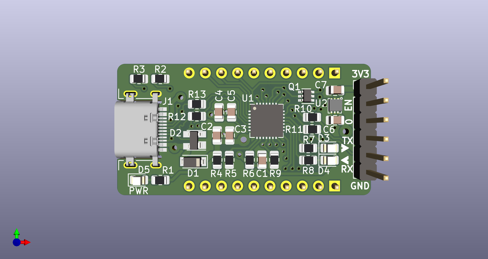
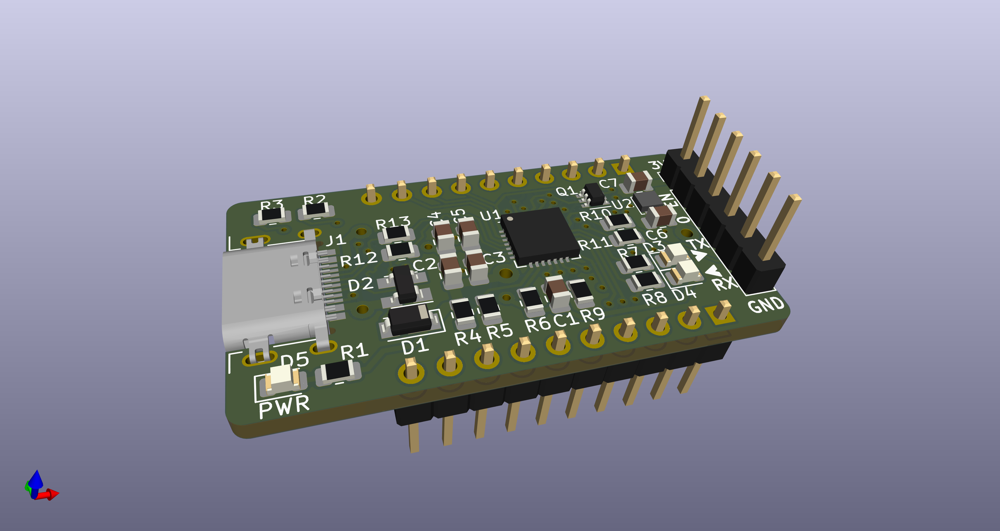
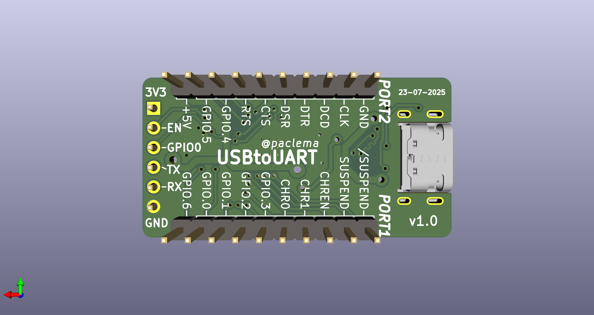

# USBtoUART

A compact USB-C to UART bridge board based on the Silicon Labs CP2102N chip and featuring a dedicated XC6220B331ER LDO regulator, designed for debugging, programming, and serial communication with microcontrollers and embedded systems.

**Why this board?** Unlike typical USB-to-UART bridges, this board features a dedicated LDO regulator that supplies up to 1A at 3.3V, ensuring stable power delivery to the target board while providing reliable data communication.

| Top View | 3D Rendering | Bottom View |
|:--------:|:------------:|:-----------:|
|  |  |  |

## Features

- **USB-C Connector**: Modern USB-C interface for reliable power and data connection (USB 2.0)
- **CP2102N Bridge Chip**: High-performance USB to UART bridge controller (up to 3 Mbaud)
- **High-Power LDO**: Dedicated XC6220B331ER regulator providing up to 1A at 3.3V for connected devices (the CP2102N operates directly from USB 5V)
- **Status LEDs**: Visual indicators for Power (PWR), Transmit (TX), and Receive (RX)
- **UART Breakout**: Dedicated 6-pin UART connector with standard pinout
- **Extended GPIO Access & Breadboard Compatibility**: Exposes extra CP2102N GPIO pins via dual 10-pin headers, designed for direct insertion into standard breadboards to simplify prototyping and expand control options
- **Auto-Reset Circuit**: Dual MOSFET transistor circuit enables automatic reset of the connected microcontroller during programming
- **Compact Form Factor**: Optimized 2-layer PCB layout with surface-mount components (0805 package size)

## Pin Configuration

### UART Connector (J3)
> **Note:** In ESP8266 and ESP32 family chips, their GPIO0 pin is used to control boot mode (e.g., entering flash mode for programming). The labeled GPIO0 pin in this connector is intended to be connected to the target chip's GPIO0 pin to control the boot mode. This usage may not apply to other target chips, so verify your specific hardware requirements.
> 
| Pin | Function | Description |
|-----|----------|-------------|
| 1   | 3V3      | 3.3V Power Output |
| 2   | EN       | Enable/Reset |
| 3   | GPIO0    | Boot mode control |
| 4   | TXD      | UART Transmit |
| 5   | RXD      | UART Receive |
| 6   | GND      | Ground |

### Port Connectors (J2, J4)
- 10-pin male headers providing access to power rails (3.3V, 5V, GND) and CP2102N GPIO signals
- Enable powering and controlling external circuits directly from the board
- Compatible with standard breadboard and prototyping setups
- Standard 2.54mm (0.1") pin spacing

#### PORT1 Connector (J2)
| Pin | Function | Description |
|-----|----------|-------------|
| 1   | GPIO.6   | CP2102N GPIO 6 |
| 2   | GPIO.0   | CP2102N GPIO 0 |
| 3   | GPIO.1   | CP2102N GPIO 1 |
| 4   | GPIO.2   | CP2102N GPIO 2 |
| 5   | GPIO.3   | CP2102N GPIO 3 |
| 6   | CHR0     | Battery Charging Detection 0 |
| 7   | CHR1     | Battery Charging Detection 1 |
| 8   | CHREN    | Battery Charging Enable |
| 9   | SUSPEND  | USB Suspend State |
| 10  | /SUSPEND | USB Suspend State (Inverted) |

#### PORT2 Connector (J4)
| Pin | Function | Description |
|-----|----------|-------------|
| 1   | +5V      | 5V Power Output (from USB connector) |
| 2   | GPIO.5   | CP2102N GPIO 5 |
| 3   | GPIO.4   | CP2102N GPIO 4 |
| 4   | RTS      | Request To Send |
| 5   | CTS      | Clear To Send |
| 6   | DSR      | Data Set Ready |
| 7   | DTR      | Data Terminal Ready |
| 8   | DCD      | Data Carrier Detect |
| 9   | CLK      | Clock output |
| 10  | GND      | Ground |

## Getting Started

### Driver Installation

Download and install the CP210x Universal Windows Driver:
[CP210x Universal Windows Driver](https://www.silabs.com/developers/usb-to-uart-bridge-vcp-drivers?tab=downloads)

### Connection

1. Connect your target device to the UART connector (J3) or port headers
2. Connect the USB-C cable to your computer
3. The PWR LED should illuminate, indicating successful power connection
4. TX/RX LEDs will flash during data transmission

### Device Configuration

The CP2102N chip allows customization of USB device descriptors including vendor ID, product ID, serial number, and other parameters:

#### Using Silicon Labs Simplicity Studio 5:
1. Download and install **Simplicity Studio 5** from [Silicon Labs](https://www.silabs.com/developers/simplicity-studio)
2. Connect the USBtoUART board to your computer
3. Launch Simplicity Studio 5 and select your CP2102N device from the detected devices list
4. Navigate to **USBXpress™ Device Configuratior** utility
5. Configure device descriptors (Product String, Vendor and Product IDs, Serial Number, etc.) and save them to the device

## Hardware Files

This repository contains complete hardware design files:

- **Schematics**: [`USBtoUART.kicad_sch`](USBtoUART.kicad_sch) - Complete circuit design
- **PCB Layout**: [`USBtoUART.kicad_pcb`](USBtoUART.kicad_pcb) - 2-layer PCB design
- **Bill of Materials**: [`bom/v1.0/USBtoUART.csv`](bom/v1.0/USBtoUART.csv) - Complete component list
- **Interactive BOM**: [`bom/v1.0/ibom.html`](bom/v1.0/ibom.html) - Interactive Bill of Materials
- **Gerber Files**: [`gerber/v1.0/`](gerber/v1.0/) - Manufacturing files
- **Documentation**: 
  - **Schematic PDF**: [`doc/v1.0/USBtoUART_sch_v1.0.pdf`](doc/v1.0/USBtoUART_sch_v1.0.pdf)
  - **PCB Layout PDFs**: [`doc/v1.0/USBtoUART_brd_top_v1.0.pdf`](doc/v1.0/USBtoUART_brd_top_v1.0.pdf), [`doc/v1.0/USBtoUART_brd_bottom_v1.0.pdf`](doc/v1.0/USBtoUART_brd_bottom_v1.0.pdf), [`doc/v1.0/USBtoUART_brd_layers_v1.0.pdf`](doc/v1.0/USBtoUART_brd_layers_v1.0.pdf)
  - **3D Model**: [`doc/v1.0/USBtoUART.step`](doc/v1.0/USBtoUART.step) - STEP file for mechanical design
  - **Board Images**: [`doc/v1.0/`](doc/v1.0/) - High-resolution PNG images and X-ray views

## Manufacturing

The board is designed for standard PCB manufacturing processes:
- **PCB Thickness**: 1.6mm
- **Minimum Track/Space**: 0.1mm/0.1mm
- **Minimum Via**: 0.2mm
- **Surface Finish**: HASL or ENIG recommended

## Version History

- **v1.0**: First release